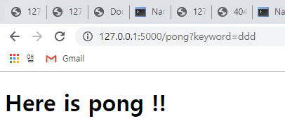

# Flask

웹 프레임워크 


가상환경 상황에서(venv) 설치 !! 

pip install flask 


flask 홈페이지(https://www.palletsprojects.com/p/flask/)에서  아래 코드를 복붙

```python
from flask import Flask, escape, request

app = Flask(__name__)

@app.route('/')
def hello():
    name = request.args.get("name", "World")
    return f'Hello, {escape(name)}!'
```

한편, git bash에서는 아래코드 작성

```shell
$ env FLASK_APP=hello.py flask run
```

결과로 나오는 http 주소를 복붙해서 링크를 열면,

파이썬이 html 형식으로 출력됨.


JInja 문법 : html 에서 자연스럽게 파이썬 문구로 바꿀 수 있게 해준다. 

{##}

주석은 이렇게 작성해야함. 


debug 모드 : flask run 은 변경사항을 받아들이지 못함. 서버 끄고 새로고침 해서 다시 들어가야함

이 모드는 (개발자 모드) 자연스럽게 서버를 자동으로 읽어들일 수 있다. 

name이 뭐라구 ?

"__main__" 은 파일 이름을 뜻한다. 





form 으로 데이터를 보내면

keyword 에서 저장해서 keyword 값을  html로(pong) 으로 보냄. 


특별 주소 뒤에 물음표. 

네이버에서는 키워드가 아닌 query로 저장하고 있다. 


ping -> form 사용. pong 으로 데이터 제출함.

ping에서 keyword에 값이 담겨져서 

그 값이

request(url을 요청하고 답변을 받는 역할)를 통해서 가져오게 됨. 그 가져온 값을 data 변수로 pong에 넣어줌. 

 